# LABORATORY-AWS-SNS

This laboratory is my testing of the AWS service SNS. I have tested to send myself notifications and emails to my application using SNS. For this, I have been using **NX** for creating the workspace, **AWS SNS SDK** for calling the api, **ngrok** for create a tunnel between aws and muy local application and finally **Express** to create the API. I have also use the serverless **lambda** application to test to send the notification from it.

## Plan of the presentation

I explain with all the details how I build the project and my way of working.

- [Theory](#theory)
- [Development](#development)
- [Result](#result)
- [Running](#running)
- [System](#system)

## Development

For creating this lab, there are two important steps. First I needed to configure the SNS topic using my AWS console and the second step is writting the code to be able to send a notification and to received one.

#### Create a topic SNS and create a subscription

The first step is to go for the SNS service using the search bar (alt + s). Once on the service, click on the orange button "Create Topic". I will be choosing a standard topic, I just have to fill up the name.

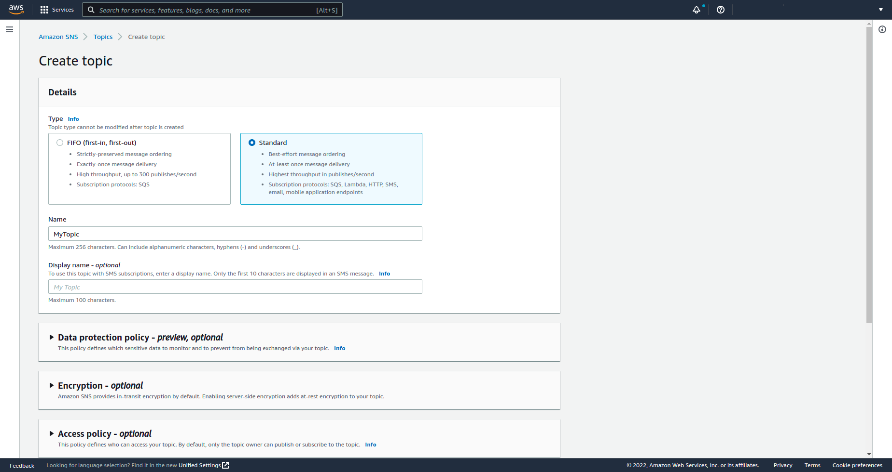

Now I can click on the topic and create a subscription

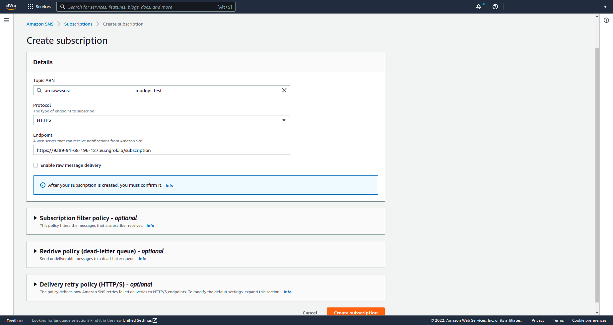

It's pretty straighforward since I will be sending my notification to my endpoint. I simply register my endpoint from ngrok redirecting the trafic to my local application. Once done my subscription will be on pending

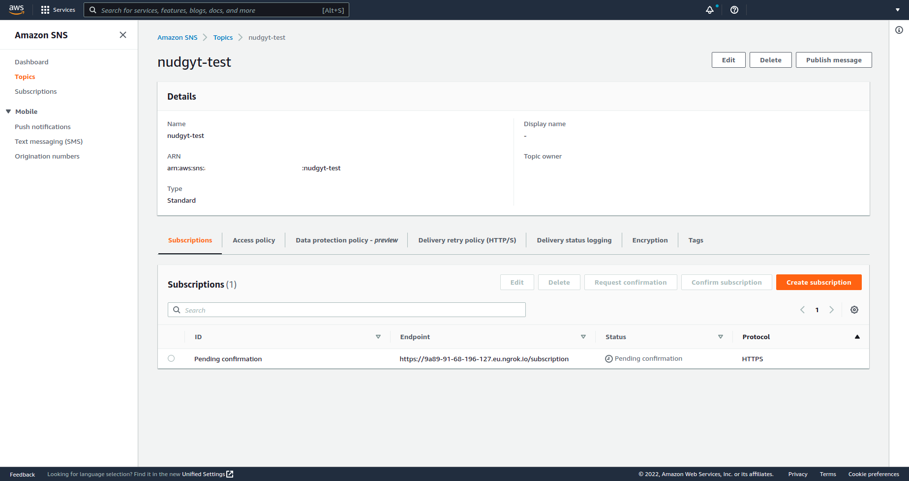

#### Confirming subscription

```js
router.post(
  "/",
  express.text(),
  (req: express.Request, res: express.Response<{ status: string }>) => {
    let payloadStr = req.body;
    const payload = JSON.parse(payloadStr);
    if (req.header("x-amz-sns-message-type") === "SubscriptionConfirmation") {
      const url = payload.SubscribeURL;
      console.log("URL:", url);
    } else if (req.header("x-amz-sns-message-type") === "Notification") {
      console.log(payload);
    } else {
      throw new Error(`Invalid message type ${payload.Type}`);
    }
  }
);
```

I can now choose my pending subscription and request for a confirmation.

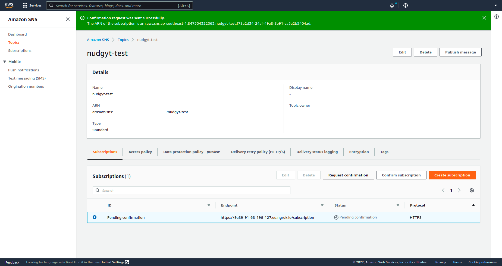

If I look at the log, I will have receive a link that I will be copying and pasting to AWS.

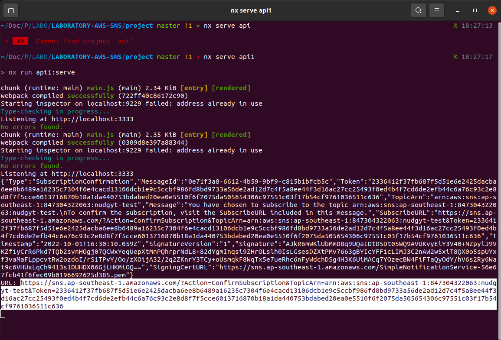

Once again, I choose my pending subscription and click on "Confirm Subscription" where I will be pasting my previous validating link.

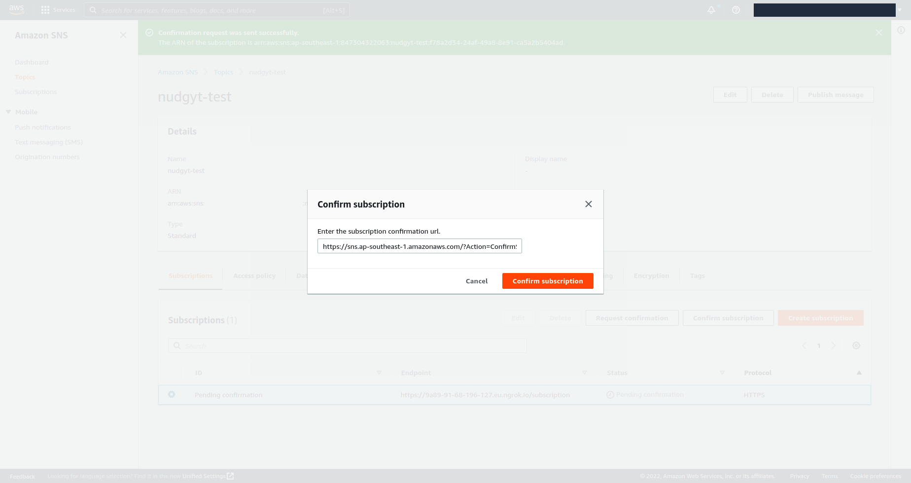

And if everything went fine, I have now a confirmed subscription.

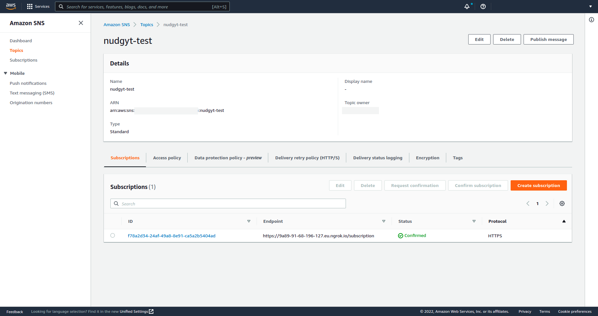

#### Test by code

Now I can validate the link by sending a message either by using the "Publish Message" button on my topic or either using the following endpoint of my API.

```js
router.post(
  "/publish",
  express.text(),
  (req: express.Request, res: express.Response) => {
    const publishTextPromise = sns
      .publish({
        Message: req.body,
        TopicArn: process.env.TOPIC_ARN,
      })
      .promise();

    publishTextPromise
      .then(function (data) {
        res.send({ messageID: data.MessageId });
      })
      .catch(function (err) {
        throw new Error(err);
      });
  }
);
```

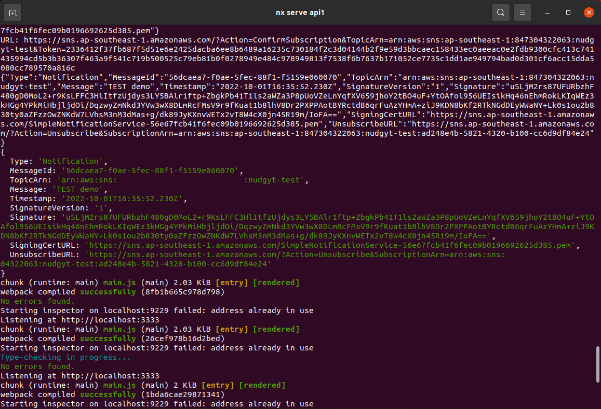

#### Lambda

I can be a little fancy and try to send the notification from the lambda function. It will be important and interesting to know that since lambda can integrate with any service from AWS.

I search for the lambda service and click on the button "Create Function".

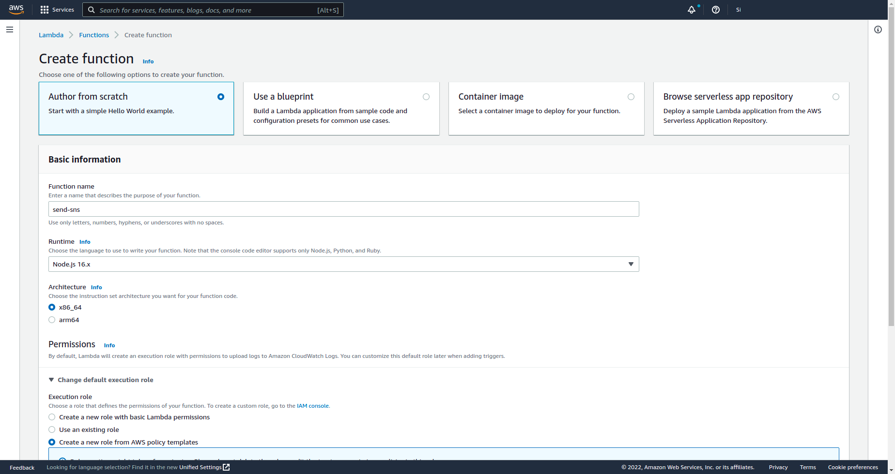

Pay attention to the role section, since I will be using the SNS, we have to give the necessaries permissions to the lambda function.

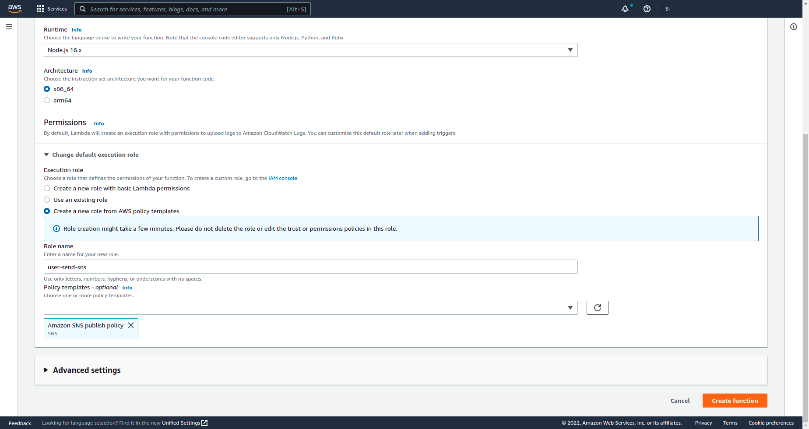

Finally, copy and paste the following code with the right information and it should be good to go.

```js
const AWS = require("aws-sdk");

exports.handler = async (event) => {
  var sns = new AWS.SNS({ region: "<region>" });
  return sns
    .publish({
      TopicArn: "arn:aws:sns:<region>:<iam>:nudgyt-test",
      Message: "Test Lambda",
    })
    .promise();
};
```

Click on the "deploy" button and then "test" button and I can check the result in the terminal of my API.

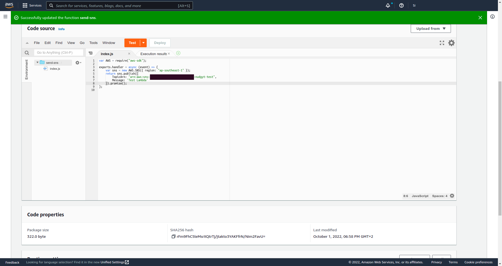

Sent response

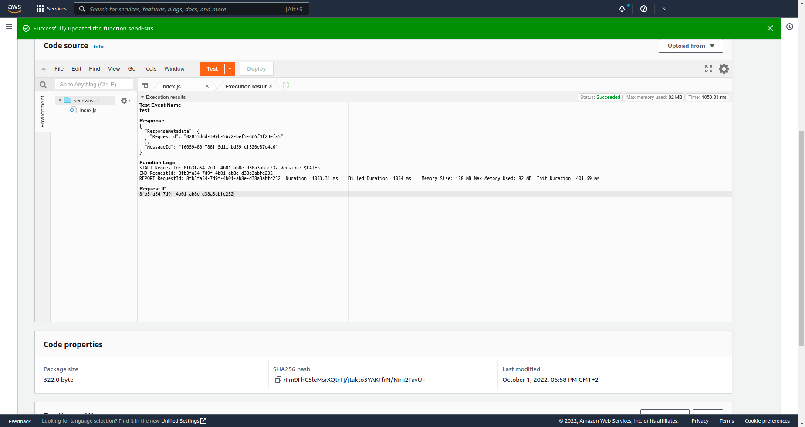

## Running

I am using NX, so for starting the project use the following command:

```bash
$ nx serve api
```

For testing the app, use Postman.

## System

Ubuntu Version: Ubuntu 20.04.1 LTS
Node Version: v16.15.1

```bash
# Get the version of node
$ node -v

# Get the latest version of ubuntu
$ lsb_release -a
```
